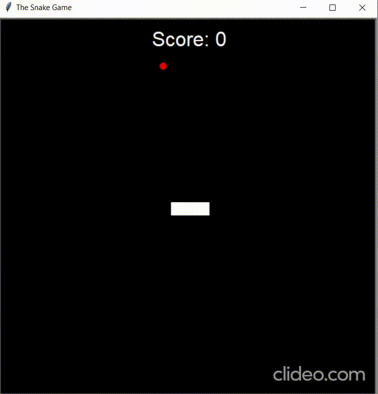

# Snake Game :snake:

## Table of contents
* [Get Started](#get-started)
* [Introduction](#introduction)
* [Demo](#demo)
* [Setup](#setup)
* [Built with](#built-with)
* [How to use](#how-to-use)
* [Download](#download)

# Get Started

## Introduction
Snake is the common name for a video game concept where the player maneuvers a line which grows in length, with the line itself being a primary obstacle. The player attempts to eat items by running into them with the head of the snake. Each item eaten makes the snake longer, so avoiding collision with the snake becomes progressively more difficult. The player loses when the snake runs into the screen border, a trail or other obstacle, or itself.

## Demo


## Setup
To clone and run this application, you'll need [Git](https://git-scm.com/downloads), [Python](https://www.python.org/downloads/) and pip (already installed with Python 2 >=2.7.9 or Python 3 >=3.4) or [Anacond](https://docs.anaconda.com/anaconda/install/) installed on your computer.

### Built with
* Python version: 3.8.3
* pip version: 20.3.3
* [turtle](https://docs.python.org/3/library/turtle.html)

### Install
You can install random using pip
```consol
pip install random
```
On Anaconda install random using Anaconda Promt
```consol
conda install random
```

## How to use?
From your command line:
```console
# Clone this repository
$ git clone https://github.com/tirth1/snake-game

# Go into the repository
$ cd snake-game/app

# run main.py
$ python main.py

```

## Download
You can [download](https://github.com/tirth1/hangman/releases/tag/1.0.1) the latest installable version of Hangman for Windows, Linux and macOS.